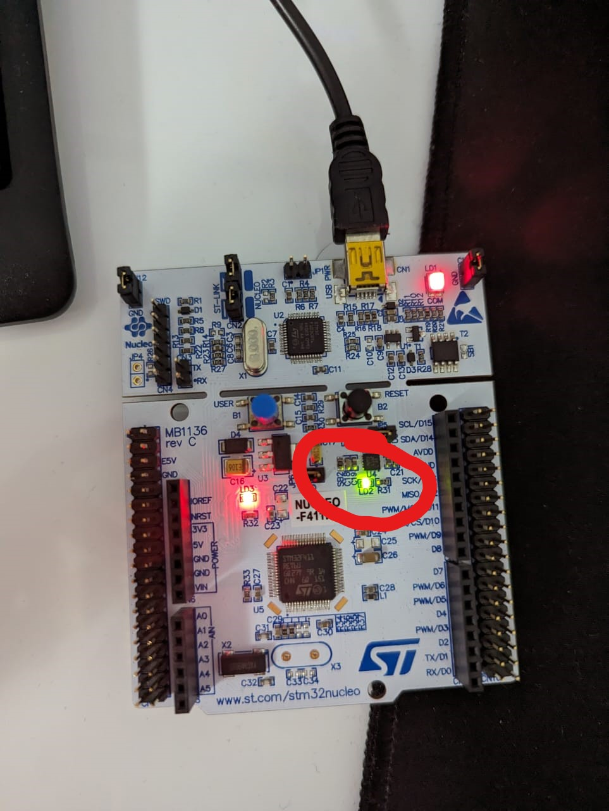

# STM32Blink
## Description
Blink project - Blink LED LD2 on the Nucleo board

## Toolchain
CubeMX, GCC, Make and OpenOCD
## Prerequisites
- STM32F4x Nucleo board
- arm-none-eabi-gcc
- openocd
## Run commands
- make flash